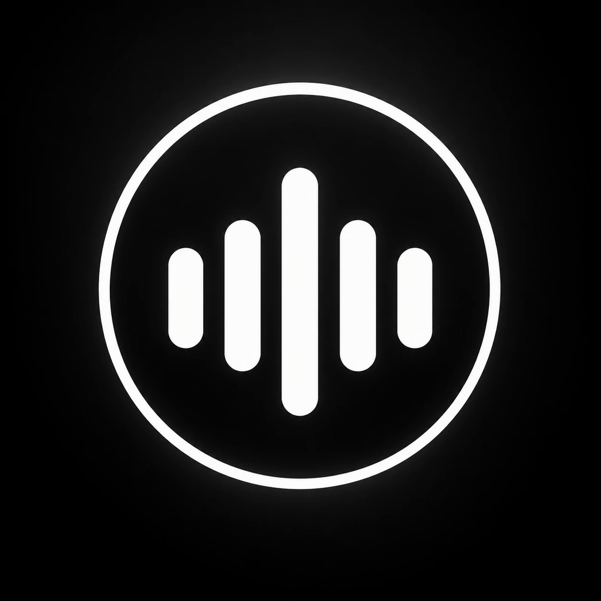

<p align="center"></p>

# Mispr Flow

Private, fully local voice control for macOS. Hold **fn**, speak, and clean, punctuated text appears in whatever app you're typing in. Hold your **switch key** and say "Chrome beside VS Code", "new tab", "pause" or "open folder Projects". Take **meeting notes** that know who said what. Speech recognition, cleanup, speaker detection and summaries all run on your Mac: your voice never leaves it.

An open clone of the Wispr Flow desktop experience, without the cloud.

**macOS · Apple Silicon · 100% on-device · free · [MIT licensed](LICENSE)**

```bash
python3.13 -m venv .venv && .venv/bin/pip install cmake
CMAKE_ARGS="-DGGML_METAL=on" .venv/bin/pip install -r requirements.txt
.venv/bin/python -m mispr        # then hold fn and speak
```

## Why

1. **Open source.** MIT licensed. Every line is readable, auditable and changeable: the hotkey, the audio pipeline, the prompts, the safety checks.
2. **Free.** No subscription, no account. The models are free downloads.
3. **Your voice stays on your Mac.** Cloud dictation sends your audio to someone's servers. Mispr Flow transcribes, cleans up and summarizes on-device.
4. **Yours to change.** Icons, sounds, widget, shortcuts, models and the cleanup prompt (edit it live on the Prompts page).

## Features

| | | Guide |
|---|---|---|
| **Dictation** | Hold or double-tap fn (or any key you pick). Local Whisper plus a cleanup model that never invents words. Pastes into the focused text box, or copies if there isn't one. Incognito saves nothing. **Auto-Enter** sends what you said. **Terminal mode** turns "ls flag a" into `ls -a` | [dictation](docs/features/dictation.md) |
| **Voice commands** | Hold a switch key (a key or a combo like ⌃⌥) and say:<br>• switch, close, minimize, expand, quit<br>• "Chrome beside VS Code", "Chrome 80%"<br>• new tab, reload, zoom<br>• pause, skip 30 seconds, volume, mute mic/tab<br>• scroll<br>• "open folder Projects"<br>• nicknames<br>It never opens an app on a guess, and keeps a Commands history | [voice commands](docs/features/voice-commands.md) |
| **Meeting notes** | ⌥M records you and the call at once:<br>• live text, speakers told apart (TitaNet), male/female labels<br>• speaker echo and clicks filtered out<br>• local summary and Q&A<br>• save only when you choose | [meeting notes](docs/features/meeting-notes.md) |
| **Notetaker and People** | Past notes with search, insights and deleting (one or many); people with rename, merge and contact cards | [notetaker](docs/features/notetaker.md) |
| **Main window** | Home (history: Dictation and Commands), Insights, Notetaker, Prompts, Settings (profile, 6 themes, keys, sounds) | [main window](docs/features/main-window.md) |
| **Setup** | A guided window: required permissions, optional features, model downloads | [setup and permissions](docs/features/setup-and-permissions.md) |
| **Privacy** | No network use except one-time, hash-checked model downloads | [privacy](docs/features/privacy.md) |

End to end, dictated text appears about 1.8 s after you stop talking.

## Requirements

- Apple Silicon (M1 or newer). Developed on an M1 Pro, 16 GB, macOS 26.
- About 3.1 GB of disk for the dictation models. Meeting notes add about 250 MB (downloaded on first use). All are SHA-256 verified.
- About 3.5 GB of RAM while running.
- Python 3.13 and Xcode's Swift toolchain (to run from source).
- Permissions, asked for in setup with an explanation:
  - **Required:** Microphone, Accessibility.
  - **Optional:** Screen & System Audio (meeting notes), Full Disk Access (open folder), Control Finder.

## Install and run

```bash
python3.13 -m venv .venv
.venv/bin/pip install cmake
CMAKE_ARGS="-DGGML_METAL=on" .venv/bin/pip install -r requirements.txt
tools/make_signing_cert.sh      # once: local signing, so permissions survive rebuilds
tools/trust_signing_cert.sh     # once: asks for your password
tools/build_app.sh --open       # builds and opens Mispr Flow.app
```

The app runs this checkout's Python engine in the background. Setup walks you through permissions and downloads the models. More: [getting started](docs/getting-started.md), [troubleshooting](docs/troubleshooting.md).

## Settings

In the app (Settings), or `~/Library/Application Support/Mispr_Flow/settings.json`:

| Key | Default | Meaning |
|---|---|---|
| `incognito` | `false` | Save nothing; type instead of paste |
| `auto_enter` | `false` | Press Return after dictated text is pasted (also in terminals) |
| `cleanup` | `true` | `false` pastes raw Whisper text |
| `sounds` | `true` | Sound cues |
| `hotkey` | fn | The dictation key: `{"kind": "fn" \| "modifier" \| "key", "keycode", "label"}` |
| `switch_hotkey` | off | The voice command key; also `{"kind": "combo", "mods": [...], "keycode": null}` |
| `app_nicknames` | `{}` | Spoken nicknames: `{"c": "Google Chrome"}` |
| `onboarded` | `false` | Setup finished |

## Where things live

| What | Where |
|---|---|
| Models | `~/Library/Application Support/Mispr_Flow/models/` |
| Settings, prompts | `~/Library/Application Support/Mispr_Flow/` |
| Dictations and commands | `voice-recordings/YYYY-MM-DD/` (WAV + JSON, gitignored) |
| Meeting notes, contacts | `meeting-recordings/` (gitignored) |
| Engine log | `~/Library/Logs/Mispr Flow/engine.log` |
| Change and test reports | [logs/](logs/README.md) |

## Testing

```bash
.venv/bin/pip install -r requirements-dev.txt
.venv/bin/python -m pytest          # 1217 Python tests, ~13 s
cd macos && swift test              # 287 Swift tests
```

Every function has tests, and Python line coverage is 96%. Tests never touch the real mic, clipboard, keyboard, models or your files. See [testing](docs/testing.md) and the latest [test catalog](logs/README.md).

## Documentation

- **Features:** [dictation](docs/features/dictation.md) · [voice commands](docs/features/voice-commands.md) · [meeting notes](docs/features/meeting-notes.md) · [notetaker](docs/features/notetaker.md) · [main window](docs/features/main-window.md) · [setup](docs/features/setup-and-permissions.md) · [privacy](docs/features/privacy.md)
- **How it works:** [architecture](docs/architecture.md) · [engine ↔ app protocol](docs/engine-protocol.md) · [models](docs/models.md) · [data formats](docs/data-formats.md) · [testing](docs/testing.md) · [every test](docs/tests/README.md) · [development](docs/development.md)
- **Code:** [mispr/](mispr/README.md) ([assets](mispr/assets/README.md)) · [macos/](macos/README.md) ([MisprCore](macos/Sources/MisprCore/README.md), [MisprFlow](macos/Sources/MisprFlow/README.md), [Views](macos/Sources/MisprFlow/Views/README.md), [Swift tests](macos/Tests/README.md)) · [tests/](tests/README.md) ([golden](tests/golden/README.md)) · [tools/](tools/README.md) · [logs/](logs/README.md) · [docs/](docs/README.md)
- **Help:** [getting started](docs/getting-started.md) · [troubleshooting](docs/troubleshooting.md) · [contributing](CONTRIBUTING.md) · [changelog](CHANGELOG.md) · [plan and roadmap](plan.md)
- **Knowledge base**, to bring an AI assistant up to speed on everything, including the full chat history: [knowledge-base/](knowledge-base/README.md) (paste [ALL-IN-ONE.md](knowledge-base/ALL-IN-ONE.md))

## Status

Dictation, voice commands, the main window and meeting notes all work, as a signed local `.app`.

**Next:**
- a first-run tutorial;
- a security and network audit;
- languages;
- a dictionary and snippets;
- an installable app for other Macs.

See [plan.md](plan.md).

## License

Mispr Flow's code is [MIT licensed](LICENSE). Models are downloaded, not included:
- Whisper: MIT.
- Gemma: Google's Gemma Terms of Use.
- TitaNet: NVIDIA, CC BY 4.0.
- Silero VAD: MIT.

The gender weights were trained on the AMI Meeting Corpus and LibriSpeech (both CC BY 4.0). Mispr Flow is an independent project, not affiliated with Wispr Flow.
